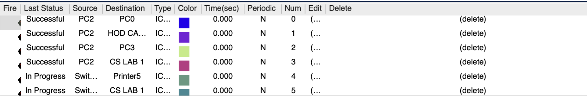

# College Network Simulation Project

## Table of Contents

- [Overview](#overview)
- [Aim of the Experiment](#aim-of-the-experiment)
- [Requirements](#requirements)
- [Cisco Packet Tracer](#cisco-packet-tracer)
- [Theory](#theory)
  - [Network Segmentation and VLANs](#network-segmentation-and-vlans)
  - [Dynamic Routing with RIP](#dynamic-routing-with-rip)
  - [Device Configuration and Security](#device-configuration-and-security)
- [Code Development](#code-development)
- [Observations / Results / Graphs](#observations--results--graphs)
- [Conclusion](#conclusion)
- [Team Members & Acknowledgments](#team-members--acknowledgments)
- [References](#references)

---

## Overview

The **College Network Simulation Project** demonstrates the design, simulation, and analysis of a robust Local Area Network (LAN) for a college. Using Cisco Packet Tracer, the project implements VLANs for departmental segmentation, dynamic routing with RIP, and integration of various network devices (routers, switches, wireless access points, and servers). The simulation helps in validating the network design, performance, and scalability.

---

## Aim of the Experiment

- **Design and Simulate a College LAN:** Develop a secure and scalable network that connects different departments (IT, Computer Science, Office, Exam Center, etc.).
- **Implement VLANs:** Segregate network traffic to enhance performance and security.
- **Configure Dynamic Routing:** Use Routing Information Protocol (RIP) for efficient packet routing between subnets.
- **Test Network Services:** Validate connectivity through simulated web hosting, FTP server testing, and remote access.
- **Demonstrate Network Efficiency:** Showcase reduced downtime, efficient bandwidth usage, and enhanced management capabilities.

---

## Requirements

### Hardware and Software

- **PC/Workstation:** A computer with sufficient processing power.
- **Cisco Packet Tracer:** Simulation tool for network design and testing.
- **Networking Devices (Simulated):**
  - Cisco Routers (e.g., Router0, Router1, Router2)
  - Cisco Catalyst Switches (e.g., 6509, 4500 series)
  - Cisco Aironet Wireless Access Points
  - Firewall modules and servers (FTP, DNS, Web servers)

### Additional Materials

- Detailed network design documents and IP addressing/VLAN configuration plans.
- Configuration scripts and command line snippets used in device setup.
- Documentation of testing procedures, observations, and performance metrics.

---

## Cisco Packet Tracer

Cisco Packet Tracer is a network simulation tool developed by Cisco Systems. It allows the creation of detailed network topologies, configuration of network devices, and simulation of realistic network traffic. In this project, Packet Tracer is used to:

- **Model the College Network:** Establish a virtual environment that mirrors the college’s LAN.
- **Configure Network Devices:** Set up VLANs, IP addressing schemes, and dynamic routing protocols (RIP).
- **Simulate Network Traffic:** Test connectivity between departments and validate network performance.
- **Analyze Performance:** Generate graphical outputs for traffic flow, latency, and throughput for evaluation.

---

## Theory

### Network Segmentation and VLANs

- **Virtual Local Area Networks (VLANs):**  
  VLANs logically segment the physical network into multiple broadcast domains. In this project, different departments (IT, Computer Science, Office, etc.) are assigned to separate VLANs to enhance security and reduce traffic congestion.

### Dynamic Routing with RIP

- **Routing Information Protocol (RIP):**  
  RIP is a simple distance-vector routing protocol that uses hop count as its metric. It dynamically exchanges routing information between routers, ensuring data packets find the best route in smaller networks.

### Device Configuration and Security

- **Switches and Routers:**  
  High-performance Cisco Catalyst switches form the network core, while routers, configured with RIP, manage inter-VLAN communication and dynamic routing.
- **Security Measures:**  
  Cisco firewall modules, along with proper access control and remote access configurations, protect the network from unauthorized access while ensuring scalability for future expansion.

---

## Code Development

The network configuration is achieved using Cisco IOS Command Line Interface (CLI) commands. Below are sample configuration snippets used in the simulation:

### VLAN Configuration on a Cisco Switch
```bash
Switch# configure terminal
Switch(config)# vlan 10
Switch(config-vlan)# name IT_Department
Switch(config-vlan)# exit
Switch(config)# vlan 20
Switch(config-vlan)# name CS_Department
Switch(config-vlan)# exit
Switch(config)# interface range fa0/1 - 10
Switch(config-if-range)# switchport mode access
Switch(config-if-range)# switchport access vlan 10
Switch(config-if-range)# exit
```

### IP Addressing and Interface Configuration on a Router
```bash
Router# configure terminal
Router(config)# interface gigabitEthernet0/0
Router(config-if)# ip address 192.168.1.1 255.255.255.0
Router(config-if)# no shutdown
Router(config-if)# exit
```

### Configuring Dynamic Routing with RIP
```bash
Router(config)# router rip
Router(config-router)# version 2
Router(config-router)# network 192.168.1.0
Router(config-router)# network 192.168.2.0
Router(config-router)# exit
```

---

## Observations / Results / Graphs

- **Successful VLAN Communication:**  
  VLAN configurations efficiently isolated traffic between different departments.

- **Dynamic Routing with RIP:**  
  Routers exchanged routing updates seamlessly. Routing tables were dynamically updated to reflect the optimal paths.

- **Service Testing:**  
  FTP and Web servers were accessible from different subnets, validating cross-network communication.

- **Graphical Analysis:**  
  Packet Tracer outputs include:
  - Console logs
  - Traffic flow simulations
  - Performance graphs and latency tracking

### Screenshots

#### Network Topology


#### VLAN and IP Plan


#### Simulation and Routing


#### Live Preview


---

## Conclusion

The simulation of the college network using Cisco Packet Tracer demonstrates that:

- **Enhanced Network Performance:** VLAN segmentation improved efficiency.
- **Effective Routing:** RIP enabled dynamic and efficient route management.
- **Scalable Architecture:** Future expansion supported without rework.
- **Secure Configuration:** Firewalls and VLANs provided isolation and security.

This project meets academic and practical requirements for network design and simulation.

---

## Team Members & Acknowledgments

**Team Members:**
- Ajit Tripathy (2230142)
- Anmol Subham (2230148)
- Avilasha Goswami (2230162)
- Deep Habiswashi (2230167)

**Institution:**  
Kalinga Institute of Industrial Technology (KIIT), Bhubaneswar, India

**Acknowledgments:**  
Thanks to faculty mentors and Cisco Systems for the tools and support that made this project possible.

---

## References

1. Sun, L. et al., IEEE, 2013.
2. Roberto Minerva et al., IEEE IOT Initiative.
3. IJES, 2017, "Design and Simulation of LAN Using Cisco Packet Tracer".
4. Qin, X.U.E., 2010. "Simulation-Based Teaching Using Packet Tracer".
5. European Journal of Operational Research, 1986.

